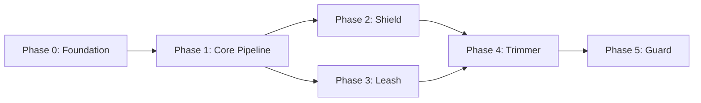

# Argent — Master Backlog

> **"A place for everything and everything in its place."**

This document tracks overall project progress across all phases. Detailed task specifications are in `docs/backlog/phase-X.md` files.

---

## Phase Overview

| Phase | Epic | Status | Progress | Description |
|-------|------|--------|----------|-------------|
| **0** | [Foundation](docs/backlog/phase-0.md) | Not Started | 0/4 | Dev environment, tooling, CI verification |
| **1** | [Core Pipeline & AgentContext](docs/backlog/phase-1.md) | Not Started | 0/3 | AgentContext state machine, middleware pipeline, telemetry |
| **2** | [Ingress Hygiene — The Shield](docs/backlog/phase-2.md) | Not Started | 0/2 | Byte-size validators, single-pass parser |
| **3** | [Budgeting & Execution Isolation — The Leash](docs/backlog/phase-3.md) | Not Started | 0/2 | Token/call counters, tool execution wrapper |
| **4** | [Semantic Context Shaping — The Trimmer](docs/backlog/phase-4.md) | Not Started | 0/2 | Format-aware truncators, dynamic budget calculator |
| **5** | [Pluggable Security Policies — The Guard](docs/backlog/phase-5.md) | Not Started | 0/2 | SecurityValidator protocol, SQL AST validator |

**Total Tasks**: 15

---

## Phase Dependencies

- **Phase 0** must complete before any other phase
- **Phase 1** must complete before Phases 2 and 3
- **Phases 2 and 3** can run in parallel after Phase 1 completes
- **Phase 4** requires Phases 2 and 3 to be complete
- **Phase 5** requires Phase 4 to be complete (Guard depends on the full pipeline)

---

## Business Rules Reference

All phases must never violate these inviolable laws:

| Rule ID | Name | Applies To |
|---------|------|------------|
| BR-01 | Absolute Budget Enforcement | Phase 3 |
| BR-02 | No Blind Truncation | Phase 4 |
| BR-03 | Semantic Over Syntactic Security | Phase 5 |
| BR-04 | Pre-Allocation Limits | Phase 2 |

---

## Quick Links

- [Phase 0: Foundation](docs/backlog/phase-0.md)
- [Phase 1: Core Pipeline & AgentContext](docs/backlog/phase-1.md)
- [Phase 2: Ingress Hygiene — The Shield](docs/backlog/phase-2.md)
- [Phase 3: Budgeting & Execution Isolation — The Leash](docs/backlog/phase-3.md)
- [Phase 4: Semantic Context Shaping — The Trimmer](docs/backlog/phase-4.md)
- [Phase 5: Pluggable Security Policies — The Guard](docs/backlog/phase-5.md)

---

## Status Legend

| Status | Meaning |
|--------|---------|
| `Not Started` | Work has not begun |
| `In Progress` | Active development |
| `Blocked` | Waiting on dependency or decision |
| `Complete` | All acceptance criteria met |

---

## How to Use This Backlog

1. **Pick a task** from the current phase
2. **Read the full spec** in the phase file
3. **Create a branch**: `feat/P<phase>-T<task>-<description>`
4. **Follow TDD**: RED → GREEN → REFACTOR → REVIEW
5. **Update status** when complete

---

## Change Log

| Date | Change |
|------|--------|
| 2026-03-04 | Initial backlog created from REQUIREMENTS.md |
