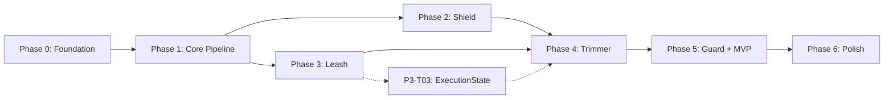

# Argent — Master Backlog

> **"A place for everything and everything in its place."**

This document tracks overall project progress across all phases. Detailed task specifications are in `docs/backlog/phase-X.md` files.

---

## Phase Overview

| Phase | Epic | Status | Progress | Description |
|-------|------|--------|----------|-------------|
| **0** | [Foundation](docs/backlog/phase-0.md) | Complete | 4/4 | Dev environment, tooling, CI verification |
| **1** | [Core Pipeline & AgentContext](docs/backlog/phase-1.md) | Complete | 3/3 | AgentContext state machine, middleware pipeline, telemetry |
| **2** | [Ingress Hygiene — The Shield](docs/backlog/phase-2.md) | Complete | 2/2 | Byte-size validators, single-pass parser |
| **3** | [Budgeting & Execution Isolation — The Leash](docs/backlog/phase-3.md) | Complete | 3/3 | Token/call counters, async tool wrapper, ExecutionState transitions |
| **4** | [Semantic Context Shaping — The Trimmer](docs/backlog/phase-4.md) | In Progress | 0/3 | ParsedPayload type fix, format-aware truncators, dynamic budget calculator |
| **5** | [Pluggable Security Policies — The Guard](docs/backlog/phase-5.md) | Not Started | 0/4 | SecurityValidator protocol, SQL AST validator, integration tests, public API |
| **6** | [Post-MVP Polish](docs/backlog/phase-6.md) | Not Started | 0/3 | Working example, thread pool config, depth heuristic improvement |

**Total Tasks**: 22

---

## Phase Dependencies

*Note: P3-T03 (ExecutionState transitions) can run in parallel with Phase 4 — it only touches `pipeline/` and has no Trimmer dependency.*

---

## Business Rules Reference

All phases must never violate these inviolable laws:

| Rule ID | Name | Applies To |
|---------|------|------------|
| BR-01 | Absolute Budget Enforcement | Phase 3 |
| BR-02 | No Blind Truncation | Phase 4 |
| BR-03 | Semantic Over Syntactic Security | Phase 5 |
| BR-04 | Pre-Allocation Limits | Phase 2 |

---

## Architecture Decisions (ADRs)

| ADR | Title | Phase |
|-----|-------|-------|
| [ADR-0001](docs/adr/ADR-0001-package-topology.md) | Package Topology | P0 |
| [ADR-0002](docs/adr/ADR-0002-middleware-contract.md) | Async Middleware Contract | P1 |
| [ADR-0003](docs/adr/ADR-0003-xml-security-dep.md) | XML Security Dependency (defusedxml) | P2 |
| [ADR-0004](docs/adr/ADR-0004-budget-context-coupling.md) | Budget/Context Coupling & Async Executor | P3 |

---

## Quick Links

- [Phase 0: Foundation](docs/backlog/phase-0.md)
- [Phase 1: Core Pipeline & AgentContext](docs/backlog/phase-1.md)
- [Phase 2: Ingress Hygiene — The Shield](docs/backlog/phase-2.md)
- [Phase 3: Budgeting & Execution Isolation — The Leash](docs/backlog/phase-3.md)
- [Phase 4: Semantic Context Shaping — The Trimmer](docs/backlog/phase-4.md)
- [Phase 5: Pluggable Security Policies — The Guard](docs/backlog/phase-5.md)
- [Phase 6: Post-MVP Polish](docs/backlog/phase-6.md)

---

## Status Legend

| Status | Meaning |
|--------|---------|
| `Not Started` | Work has not begun |
| `In Progress` | Active development |
| `Blocked` | Waiting on dependency or decision |
| `Complete` | All acceptance criteria met |

---

## How to Use This Backlog

1. **Pick a task** from the current phase
2. **Read the full spec** in the phase file
3. **Check the Open Advisory Items** table in `docs/RETRO_LOG.md` for any rows targeting this task
4. **Create a branch**: `feat/P<phase>-T<task>-<description>`
5. **Follow TDD**: RED → GREEN → REFACTOR → REVIEW
6. **Update status** when complete

---

## Change Log

| Date | Change |
|------|--------|
| 2026-03-04 | Initial backlog created from REQUIREMENTS.md |
| 2026-03-07 | P3 marked In Progress (P3-T01/T02 complete, P3-T03 added); Phase 4 updated with P4-T00 and revised P4-T02 (Option A: calculator takes RequestBudget directly); Phase 5 updated with P5-T03 (integration tests) and P5-T04 (public API); Phase 6 added (post-MVP polish); REQUIREMENTS.md NFRs corrected |
