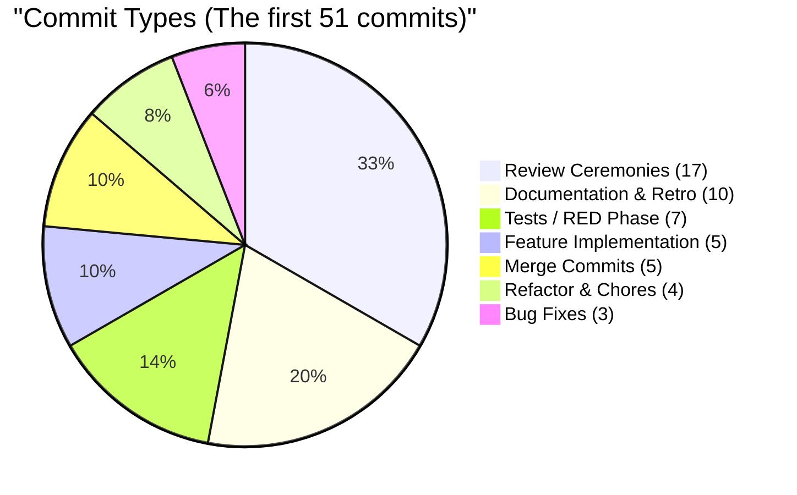
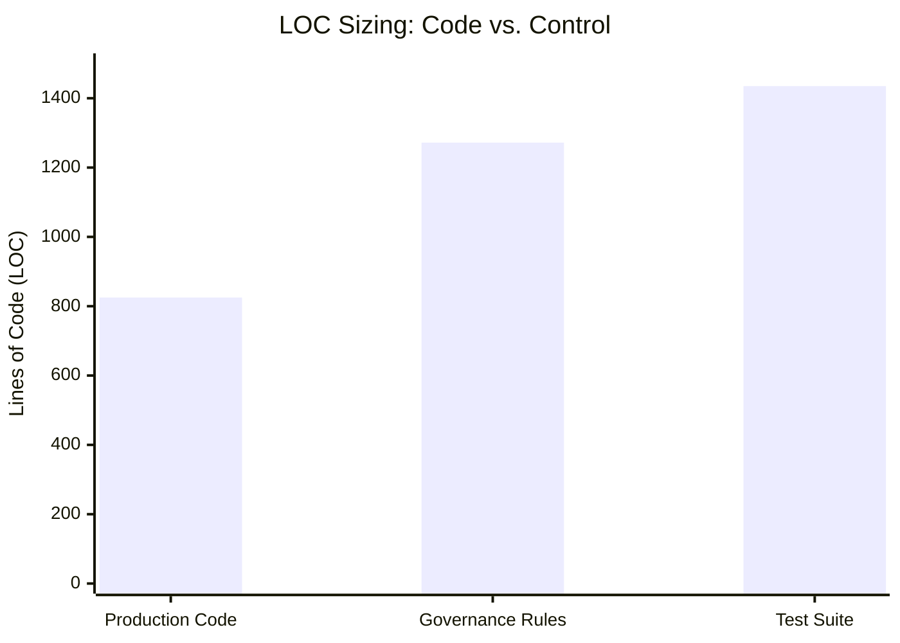
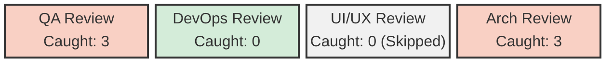
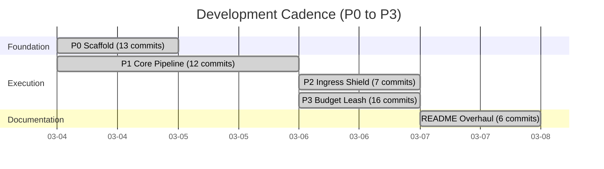

# The Cost of Autonomy: A Data Story of Argent (ARG)

**Author**: Senior Principal BI Developer
**Date**: March 2026

## Executive Summary

Autonomy is not free; it is paid for in process overhead. An analysis of the first 51 commits of the Argent (ARG) repository reveals a development lifecycle where **only 13.7% of commits are dedicated to feature implementation**, while the remaining 86.3% are distributed across process enforcement, testing, review ceremonies, and rigorous documentation.

The result is a highly secure, nearly perfectly tested (98.95% branch coverage) middleware system built entirely by an autonomous agent governed by a strict constitution. This report visualizes the data exhaust of that development process.

---

## 1. The Quality Cost: Distribution of Effort

The defining characteristic of this repository is the ratio of process to production.



**Key Insight**: For every 1 commit adding feature code, the agent generated **3.4 review commits** and **1.4 test commits**. The strict TDD (Red-Green-Refactor) and 4-subagent review ceremonies (QA, UI/UX, DevOps, Architecture) structurally mandate that feature code is the *least* frequent footprint in the git history.

The lines of code (LOC) tell a similar story:



To produce 825 lines of middleware logic, the project required a test suite almost twice that size (1,435 LOC) and is actively restrained by 1,272 lines of markdown rules (`CONSTITUTION.md`, `AUTONOMOUS_DEVELOPMENT_PROMPT.md`, `CLAUDE.md`). The rulebook is larger than the application.

---

## 2. The Engine: Process Strictness

The high ratio of non-feature commits is by design. The repository's git history strictly adheres to a sequential protocol.

```mermaid
stateDiagram-v2
    direction LR

    state "Phase 0: Context" as P0
    state "RED Phase" as Red
    state "GREEN Phase" as Green
    state "REFACTOR Phase" as Refactor
    state "Phase 3: Automated Gates" as Gates
    state "Phase 4: Agent Review" as Review

    P0 --> Red : Reads Constitution
    Red --> Green : test: commit
    Green --> Refactor : feat: commit
    Refactor --> Gates : refactor: commit
    Gates --> Review : pytest/ruff/mypy/bandit

    state Review {
        direction TB
        QA[qa-reviewer]
        UI[ui-ux-reviewer]
        DevOps[devops-reviewer]
        Arch[architecture-reviewer]
        QA --> RETRO_LOG
        UI --> RETRO_LOG
        DevOps --> RETRO_LOG
        Arch --> RETRO_LOG
    }

    Review --> PR : review: commits
```

If any check in Phase 3 or Phase 4 fails, the agent is forced back to the Green/Refactor phases. The data shows this engine is working.

---

## 3. The Catch Rate: Did the Reviews Work?

The PR history reveals that the 4-agent review ceremony correctly flagged **6 blocking findings** before code could be merged to `main`.



* **Architecture Findings**: Prevented circular dependencies and enforced the `src/argent/` module boundary rules mandated in ADR-0001.
* **QA Findings**: Flagged missing edge-case tests and enforced the 90%+ coverage gate.

Because `ui/ux` was out of scope for the backend middleware tasks (P0–P3), it accurately returned `SKIP` verdicts, and `DevOps` verified pipeline security without raising blockers. All 6 findings were fixed in subsequent commits prior to merge.

---

## 4. The Timeline: Velocity vs. Discipline

The commit timeline from March 4th to March 7th demonstrates the rhythm of an autonomous system functioning under heavy constraint.



Velocity here is intentionally throttled. While an unconstrained developer might build the same 825-line package in an afternoon, the autonomous agent requires distinct context-switches, artifact compilation, and subagent orchestration.

## Conclusion

The data proves that the Argent repository is not optimized for raw speed. It is optimized for **predictable compliance**. By exchanging velocity for strict TDD adherence, dual validation gates, and comprehensive peer-review simulations, the system guarantees 98.95% coverage and zero security regressions at the cost of significant operational overhead.
