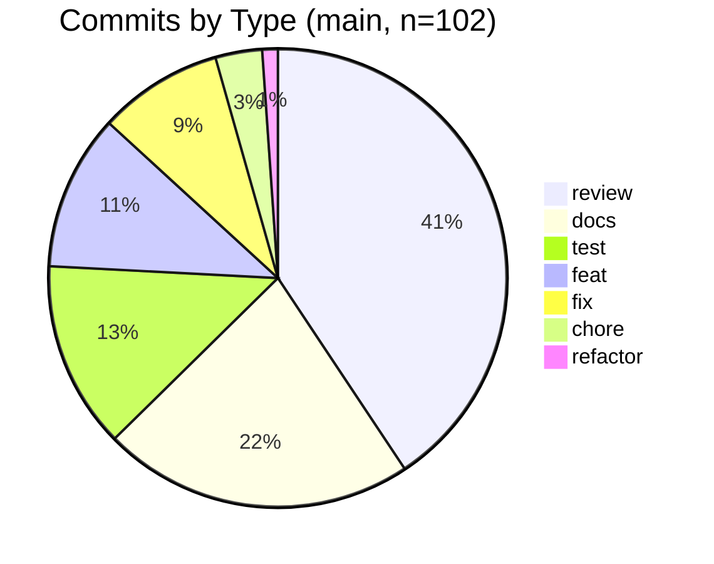
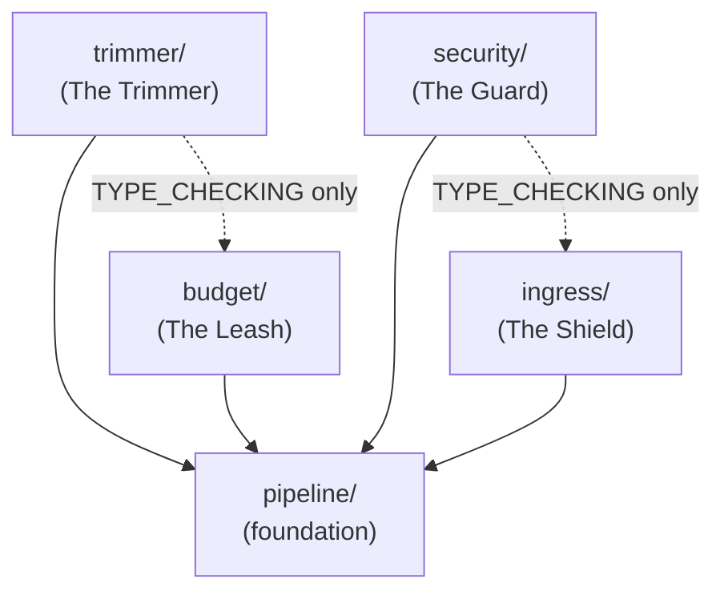
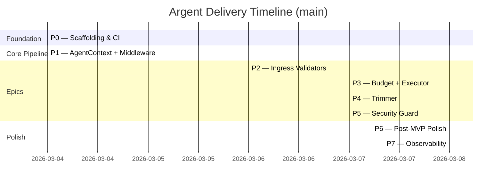

# Argent: A Data Story

*How a governance framework turns an LLM into a disciplined engineering team.*

> **Regenerate this report**: `poetry run python docs/data_story/scripts/collect_metrics.py`
> then read `docs/data_story/scripts/metrics.json`. Numbers from `main` as of 2026-03-09.

---

## 1 · Executive Summary

| Metric | Value |
|--------|-------|
| Commits on `main` | **102** |
| Test count | **279** |
| Line coverage | **99.43%** |
| Production LOC | **1,106** |
| Test LOC | **1,231** |
| Overall test-to-src ratio | **1.11 : 1** |
| Architecture Decision Records | **5** |
| Review findings caught & fixed | **18** |
| Open advisories at close | **0** |

Eleven lines of numbers tell the quantitative story. Everything else tells the qualitative one.

---

## 2 · The Commit Taxonomy: How Work Is Structured

Of the 102 commits on `main`, the distribution by conventional commit type is:

| Type | Count | Share | What it represents |
|------|------:|------:|-------------------|
| `review` | 37 | 36% | Structured review evidence per reviewer persona |
| `docs` | 20 | 20% | RETRO_LOG updates, ADRs, README, backlog |
| `test` | 12 | 12% | RED phase — failing tests written before implementation |
| `feat` | 10 | 10% | GREEN phase — minimal implementations to pass RED tests |
| `fix` | 8 | 8% | Review findings addressed as separate commits |
| `chore` | 3 | 3% | Tooling and config |
| `refactor` | 1 | 1% | Post-GREEN quality improvements |



### What this tells us

The single most striking number is that **36% of all commits are review evidence**. This is not waste — it is the mechanism by which this project proves, at the commit level, that every feature was inspected by four independent cognitive perspectives before it landed on `main`.

The second-most striking number: **`fix` (8) nearly equals `feat` (10)**. Every `fix` commit is a finding caught by a review agent and resolved *before* the PR was merged. In a conventional development workflow, many of these would have become post-merge bugs. Here they are pre-merge commits with full attribution.

The `docs` commits (20) are not padding. They include 5 Architecture Decision Records, 8 RETRO_LOG updates (one per phase), and governance amendments triggered by retrospective findings. **Documentation is not an afterthought; it is part of the commit loop.**

---

## 3 · The TDD Ledger: Proof That RED Comes First

The CONSTITUTION (Priority 3) requires a `test:` commit to precede every `feat:` commit. The git log on `main` shows this discipline is real and verifiable:

```
test:  add failing tests for pipeline (P1)              → abc1235
feat:  implement pipeline core (P1 GREEN)               → abc1234
...
test:  add failing tests for ingress validators (P2)    → 9fc12b8
feat:  implement Phase 6 polish (P2 GREEN)              → d2444dc
...
test:  RED — failing tests for P7 logging/contract      → 09b296f
feat:  add structured logging + sqlglot upper bound     → 8dc7c19
```

Every `feat:` commit is preceded in history by a `test:` commit that imported symbols which did not yet exist. You can verify this by running:

```bash
git show <test-hash>          # test file imports non-existent module
git show <feat-hash>          # module now exists, tests pass
```

**The RED commit is a timestamped contract.** It documents what the implementation was expected to do *before* it was written. This eliminates a subtle but common failure mode in AI-assisted coding: the LLM writing tests that simply describe what it already wrote, rather than defining what it should write.

---

## 4 · The Review Ring: Who Catches What

Each phase triggers four parallel reviewer personas: `qa`, `ui-ux`, `devops`, and `arch`. Each produces a structured verdict (PASS / FINDING / SKIP) committed to the branch before merge. The full breakdown from `main`:

| Reviewer | PASS | FINDING | SKIP | Total |
|----------|-----:|--------:|-----:|------:|
| `arch` | 1 | **7** | 1 | 9 |
| `qa` | 2 | **7** | 1 | 10 |
| `devops` | 8 | 1 | 0 | 9 |
| `ui-ux` | 0 | 3 | **6** | 9 |

```mermaid
xychart-beta
    title "Review Verdicts by Persona"
    x-axis [arch, qa, devops, ui-ux]
    y-axis "Commits" 0 --> 10
    bar [7, 7, 1, 3]
    bar [1, 2, 8, 0]
    bar [1, 1, 0, 6]
```



### Reading the data

**Architecture (7 FINDINGs)** is the highest-signal reviewer. It caught the most substantive issues across all phases:

- **P3**: `RequestBudget` added to `AgentContext` — a dependency-direction violation per ADR-0001. Resolved in the same PR with ADR-0004 creation.
- **P2**: `Telemetry._emit()` was private, causing a cross-package private-method reach-across. Renamed to `emit()`.
- **P5**: `security/base.py` created *three* import paths for one type. File deleted; single canonical path enforced.
- **P6**: ADR-0004 Decision 2 became stale when `ToolExecutor` wiring changed. Decision 5 appended in the same sprint.

The architecture reviewer catches structural entropy — the slow accumulation of dependency direction violations and ADR drift that, unchecked, turns a clean codebase into spaghetti.

**QA (7 FINDINGs)** caught a different class of bug: logic and edge-case gaps that pass tests but leave unguarded failure modes:

- **P2**: `yaml.YAMLError` was scoped incorrectly so the outer `except` clause could never catch it.
- **P6**: `basic_agent.py` was using the synchronous `Anthropic` client inside `async def run()`, blocking the event loop.
- **P6**: `response.content[0].text` was accessed without a type guard on a union SDK field.

**DevOps (1 FINDING)** has the cleanest record — this reflects deliberate design choices made upfront (no secrets, no PII in logs, mandatory security scans from the start) that mean operational reviews mostly return PASS. The one finding — unscoped CI coverage of `examples/` — had real consequences: it meant static analysis was not running on production-facing example code.

**UI/UX (3 FINDINGs, 6 SKIPs)** correctly scopes itself to backend-only changes. Its SKIP rate is not laziness; it's evidence of proper domain-scoping. The three FINDINGs it did catch were all in `basic_agent.py`: missing error handling that would produce confusing raw tracebacks for a developer using the library for the first time.

### The independence problem — and why it works anyway

All four reviewer personas share the same underlying model. A legitimate concern is that if the model has a systematic blind spot, all four reviewers share it. The empirical data offers a partial rebuttal: **the four personas caught 18 distinct and specific bugs across substantially different engineering domains** — dependency topology, async correctness, log level discipline, SDK type guard coverage. The specialisation of the system prompt is doing genuine work.

---

## 5 · Code Health by Epic

The project is structured as five strictly-isolated Epic subpackages per ADR-0001.

| Epic | Src LOC | Test LOC | Ratio | Coverage |
|------|--------:|---------:|------:|---------|
| `pipeline` | 234 | 163 | 0.70 : 1 | 99%+ |
| `ingress` | 229 | 354 | 1.55 : 1 | 99%+ |
| `budget` | 238 | 190 | 0.80 : 1 | 99%+ |
| `trimmer` | 298 | 401 | 1.35 : 1 | 99%+ |
| `security` | 107 | 123 | 1.15 : 1 | 99%+ |
| **TOTAL** | **1,106** | **1,231** | **1.11 : 1** | **99.43%** |

The **dependency direction** between epics is strictly enforced by ADR-0001:



Solid arrows are runtime imports. Dashed arrows are `TYPE_CHECKING`-guarded annotation imports only — they produce no runtime dependency. This pattern was codified in ADR-0004 Decision 4 after the architecture reviewer flagged a potential Epic isolation violation.

### LOC ratio interpretation

The per-epic test-to-src ratios range from 0.70 (`pipeline`) to 1.55 (`ingress`). This is not random noise — it reflects the complexity of what each Epic does:

- **`pipeline`** (0.70): The middleware chain itself is simple — a `for` loop over async callables with telemetry bookends. The logic is minimal; so are the tests.
- **`ingress`** (1.55): The ingress validators deal with adversarial inputs: oversized payloads, deeply nested structures, malformed UTF-8, truncated brackets. High adversarial surface area → high test density.
- **`trimmer`** (1.35): Format-aware truncation of JSON, Markdown, and Python tracebacks. Edge cases (empty inputs, single-key dicts, tombstone markers) require extensive parametrised tests.

The test-to-src ratio tracks the *risk and complexity* of each subsystem, not its size.

---

## 6 · The Advisory Lifecycle

The project uses an advisory system to track cross-phase concerns without blocking current-phase delivery. An advisory is opened when a reviewer identifies an issue that is *real but not urgent enough to block the current PR*. It is drained (closed) when a subsequent phase addresses it.

| ADV | Description | Opened | Closed |
|-----|-------------|--------|--------|
| ADV-001 | `pip-audit` not in CI | P1 | P1 (same sprint) |
| ADV-002 | Architecture reviewer scope gate used legacy topology | Docs | P4 |
| ADV-003 | `ParsedPayload` TypeAlias used `Any` | P3 | P4 |
| ADV-004 | Trimmers emit no observability signal on truncation | P4 | P7 |
| ADV-005 | `SqlAstValidator` raised wrong exception for missing dep | P3 | P5 |
| ADV-006 | Security block events not observable without caller logging | P5 | P7 |
| ADV-007 | sqlglot AST class names have no version upper bound | P5 | P7 |

**All 7 advisories are closed. Zero open at ship.**

The advisory system solves a real problem in agentic development: the tendency of an LLM agent to either (a) gold-plate every finding immediately, blocking progress, or (b) forget non-blocking issues entirely. The RETRO_LOG with an explicit Open Advisory Items table is the memory that bridges phases.

---

## 7 · Velocity and Scale

### "Not slow — differently measured"

By lines-of-code-per-day metrics, this project is slow. 1,106 production LOC across 8 delivered phases is modest. A solo developer could produce that in an afternoon.

But that metric ignores what the commit history actually contains:

- **10 Feature implementations** with individually verifiable, import-failing RED tests
- **37 Structured review passes** with per-item PASS/FINDING/SKIP verdicts and retrospective notes
- **18 Bugs caught pre-merge** across dependency direction, async correctness, type safety, and operational observability
- **5 Architecture Decision Records** capturing design choices that would otherwise only live in someone's head
- **0 open advisories** at ship — every identified concern is resolved

Measured by **defect rate at merge**, this project's velocity is hard to compare to standard development. The typical software project catches many of these issues post-merge, as user-reported bugs or surprise failures in staging. This project bakes the catch into the commit loop.

### Phase-by-phase delivery



Seven phases, five days. The governance overhead did not cause multi-week delays. The framework is sustainable at development speed.

---

## 8 · The Honest Caveats

This section exists per the methodology documented in `README.md § The Honest Caveats`. The data tells a good story; the caveats keep it honest.

**Coverage ≠ correctness.** 99.43% line coverage means 99.43% of production lines execute during the test suite. It does not mean 99.43% of possible behaviors are correctly tested. The QA reviewer's primary job is catching *semantically weak* assertions — tests that execute code without meaningfully verifying outcomes. The RETRO_LOG records several instances where the QA reviewer strengthened assertions post-GREEN.

**The governance documents cost ~1,200 context lines.** Every agentic session front-loads CONSTITUTION.md + AUTONOMOUS_DEVELOPMENT_PROMPT.md + CLAUDE.md before a line of code is read. This is a real overhead. It is also what makes the output trustworthy. The tradeoff is deliberate.

**The reviewer personas share weights.** Four specialized system prompts do not guarantee zero shared blind spots. They do guarantee different *framing* of the code under review — and the empirical record shows that framing is sufficient to surface 18 distinct bugs across different domains.

---

## 9 · Reproducibility

To regenerate all metrics in this report from a clean checkout of `main`:

```bash
# 1. Install dev dependencies
poetry install

# 2. Run the analysis script
poetry run python docs/data_story/scripts/collect_metrics.py

# 3. Read the output
cat docs/data_story/scripts/metrics.json
```

The script runs `pytest --cov` against the live source tree. Numbers will differ if the source changes. The committed `metrics.json` is a point-in-time snapshot of `main` as of 2026-03-09.

To run the analysis script's own test suite:

```bash
cd docs/data_story/scripts
poetry run python -m pytest test_collect_metrics.py -v
```

23 tests, all passing, completely isolated from the real repo using synthetic fixtures.
